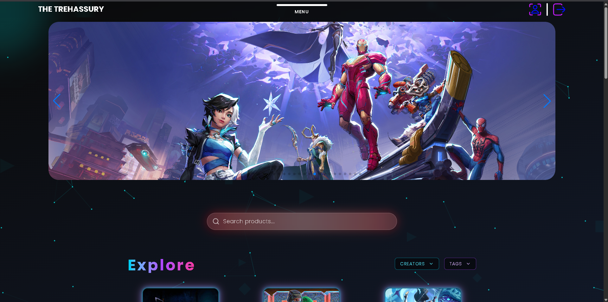
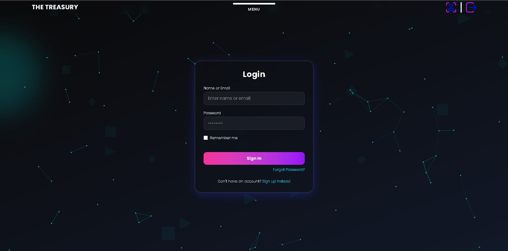
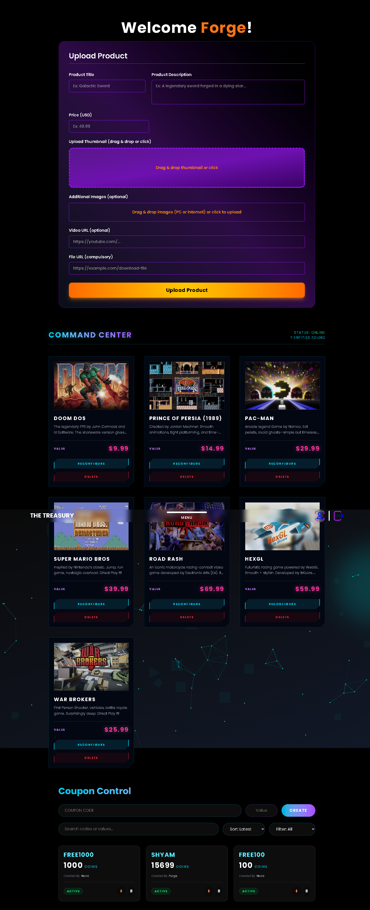

# 🏦 The Treasury Backend

The Treasury Backend is the REST API that powers **The Treasury**, a full-stack digital marketplace for digital products. It handles authentication, authorization, product management, orders, coupons, image uploads and all backend business logic used by the frontend application.

Built using **Node.js**, **Express.js** and **MongoDB**, the project follows a modular architecture with separate controllers, models, routes and middleware for improved maintainability and scalability.

---

# 🌐 Live Application

### 🚀 Visit the Live Website

https://thetreasury-orcin.vercel.app/

### 🔑 Demo Credentials (Admin Account)

Use the following credentials to explore the complete application, including administrator features.

**Username**

```text
Forge
```

**Password**

```text
1
```

> The above account has administrator privileges and can be used to explore the admin dashboard, product management, coupon management and other platform management features.

---

# ⚠️ Important Notice

> ## This project is created **strictly for educational and portfolio purposes.**

- We **do not support, encourage or promote piracy** in any form.
- We **do not own** any games, software, trademarks, logos, images or other copyrighted material displayed within this project.
- All content available on the website is **demo data** created solely to showcase full-stack web development skills.
- This project is **non-commercial** and **does not generate any monetary gain**.
- The purpose of this project is to demonstrate backend architecture, REST API development, authentication, database design and modern web application development.

---

# 📸 Application Preview

> The following screenshots are from the live application powered by this backend.

## 🏠 Home Page

Landing page of The Treasury.



---

## 🔐 Authentication

User authentication system.



---

## 📦 Product Marketplace

Browse available digital products.


---

## 🛠️ Admin Dashboard

Administrator dashboard used to manage platform content.



---

# ✨ Features

- JWT Authentication
- User Registration & Login
- Role-Based Authorization
- Product Management
- Digital Product Library Management
- Coupon System
- Order Management
- Secure Password Hashing
- Image Uploads using Cloudinary
- Multer File Upload Handling
- RESTful API Architecture
- Modular Folder Structure
- MongoDB Database Integration
- Environment Variable Configuration
- CORS Support
- Helmet Security Middleware

---

# 🛠️ Tech Stack

## Backend

- Node.js
- Express.js
- MongoDB
- Mongoose

## Authentication

- JWT
- bcryptjs

## File Uploads

- Cloudinary
- Multer

## Security

- Helmet
- CORS

## Other Tools

- dotenv
- Nodemon

---

# 📂 Project Structure

```text
the-treasury-backend

├── config/
├── controllers/
├── middleware/
├── models/
├── routes/
├── uploads/
├── utils/
├── app.js
├── package.json
└── README.md
```

---

# ⚙️ Installation

Clone the repository.

```bash
git clone https://github.com/Tekade-Ji/the-treasury-backend.git
```

Move into the project directory.

```bash
cd the-treasury-backend
```

Install all dependencies.

```bash
npm install
```

Create a `.env` file using the variables shown below.

Run the development server.

```bash
npm run dev
```

Or start the production server.

```bash
npm start
```

---

# 🔑 Environment Variables

Create a `.env` file in the project root.

```env
PORT=

MONGO_URI=

JWT_SECRET=

CLIENT_URL=

CLOUDINARY_CLOUD_NAME=

CLOUDINARY_API_KEY=

CLOUDINARY_API_SECRET=
```

---

# 🗄️ Architecture

The backend follows a modular architecture.

```text
Client

↓

Routes

↓

Middleware

↓

Controllers

↓

Models

↓

MongoDB
```

This separation keeps the project organized, scalable and easier to maintain.

---

# 📡 API Overview

The backend provides REST APIs for:

- Authentication
- Users
- Products
- Orders
- Coupons
- Image Uploads
- Administrative Operations

---

# 🔒 Security

Security practices implemented in this project include:

- Password hashing using bcryptjs
- JWT Authentication
- Protected Routes
- Environment Variables
- Helmet Security Middleware
- CORS Configuration

---

# 💡 What I Learned

Building this project helped me gain practical experience with:

- REST API Development
- Express.js
- MongoDB & Mongoose
- JWT Authentication
- Password Hashing
- Cloudinary Integration
- File Upload Handling
- Backend Project Architecture
- Environment Variables
- Building and Deploying Production-Style Backend Applications

---

# 📄 License

This project was created for educational and portfolio purposes.

---

# 👨‍💻 Author

**Yash Tekade**

GitHub: https://github.com/Tekade-Ji
